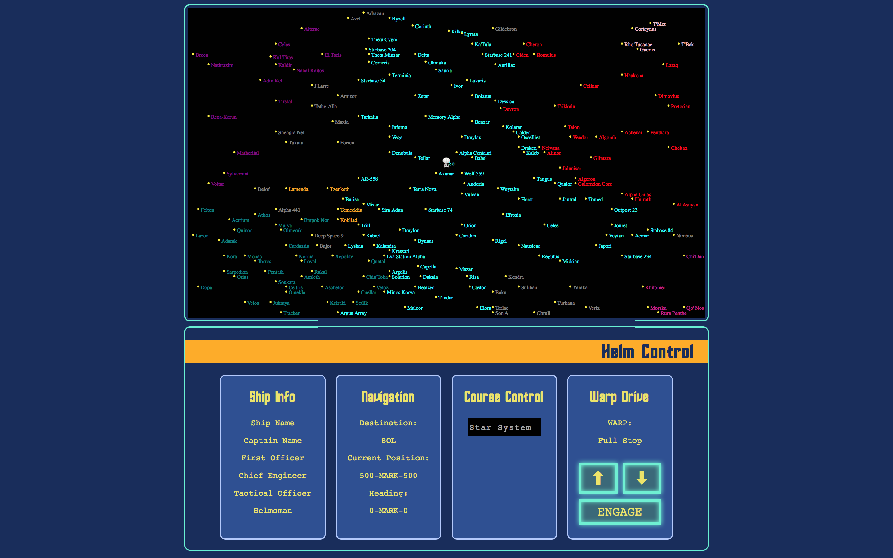
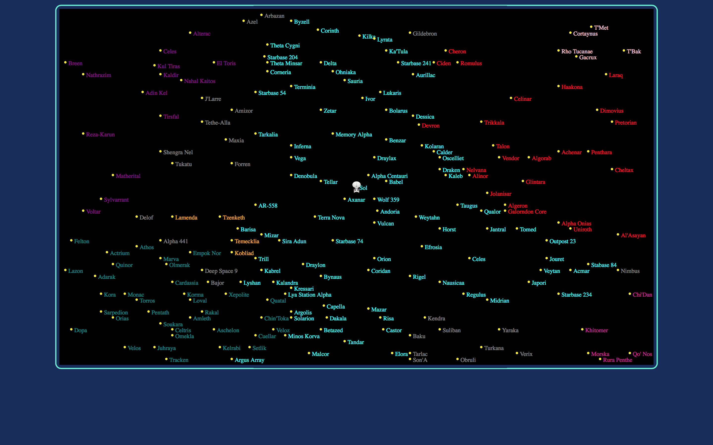
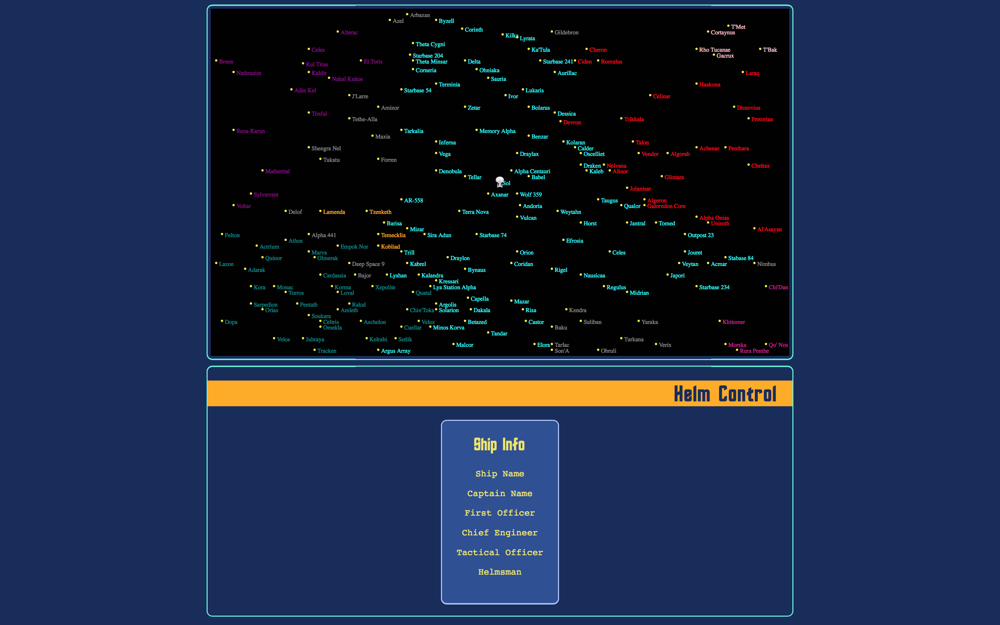

# Chapter 5: Star Trek Video Game Demo

So far we have reviewed React from a very high level. This was intentional since there are plenty of vocational tutorials on React available. However, no book on a JavaScript library is complete without a demo application explaining how to actually use the library.

Therefore, we are going to build an application that touches the most crucial parts of React's API. In order to keep it fun, we are going to build a simple Star Trek themed space travel video game. This also reinforces the idea that React's design decisions are inherited from certain game engines. It will consist of a starship on a starchart of a scaled down version of the Star Trek's Alpha Quadrant. There is plenty of state to manage here: ship location, current destination, warp factor (speed), and whether the ship is currently travelling. All this state will respond to user input.

By now, we have already gone through most of the important parts of React's API. It's API foot print is actually quite narrow compared to some other frameworks but as the Roman proverb says: "The fox has many tricks. The hedgehog has one good one."

We are going to get started building our Star Trek video game. Once we are finished, it will look something like this:



By the end of the tutorial, the game should render a star chart with star systems colored by faction as well render the image of a starship at the current position of the starship. You should be able to chart a course by selecting a star system on the star chart, or you can search a star system under the "Course Control" panel under "Helm Control". You should be able to set the name of your ship and your crew by clicking on the name. Also, you should be able to select the warp factor for your starship and engage the warp engines, which will begin the movement of the starship to it's current destination. During travel, the "Navigation" panel will display your current destination, heading, and position.

## Setup

Requirements:
* [Git](https://git-scm.com/downloads)
* [Node.js](https://nodejs.org/en/)
    * NVM is the easiest way to manage Node. [Its setup instructions here](https://github.com/creationix/nvm#installation). Then run `nvm install node && nvm alias default node`, which installs the latest version of Node.js and sets up your terminal so you can run it by typing `node`. With nvm you can install multiple versions of Node.js and easily switch between them.
    * New to [npm](https://docs.npmjs.com/)?

If you have not already done so, clone the [demo repository](https://github.com/freddyrangel/react-under-the-hood) for this tutorial. This book is not about setting up a development environment so it is highly recommended you follow along in the demo repository.

There are two main directories: `finished` and `unfinished`. You will be following along in the `unfinished` directory. `finished` is available if you are stuck or want to skip ahead. Be warned however that copy and pasting from `finished` may not always work since it represents the end state of the game. If you copy code from `finished`, it is possible that code depends on other code that is not going to be added until later in the tutorial.

That said, go ahead and `cd` into `unfinished` and run `npm i`. This will install all the dependencies required for this demo. Once that is finished, you can start the server by running `npm start` and navigating to `localhost:4000` in your browser.

## Tooling:

A little bit about tooling. We are using Webpack for managing everything other than dependencies. Webpack combines a build system like Gulp/Grunt with the functionality of Browserify and has plugins for running a development server, among many other things. Unlike Browserify, Webpack understands more than one module loading system. For this book, we are going to use CommonJS modules. 

We are using Babel.js to compile our JSX code, which would allow us to use ES2015 if we wanted to. We are going to stay away from ES2015 for this tutorial since it is not universally understood by all JavaScript developers as of today. However, ES2015 works really well with React and is worth exploring on your own.

## HelloWorld

Let's start by creating a simple "Hello, World!" example. The entry point to our app is set up to be `unfinished/app/index.jsx` so we are going to start there.

```javascript
# unfinished/app/index.jsx

require('./main.css');
var React    = require('react');
var ReactDOM = require('react-dom');
var Game     = require('./components/Game.jsx');

var appNode = document.createElement('div');
appNode.className = 'react-game';
document.body.appendChild(appNode);
ReactDOM.render(<Game />, appNode);
```

One of the first things you may notice is that we are requiring a CSS file. Webpack allows you to require CSS files. This allows developers to modularize CSS the same way we can modularize JavaScript. We are going to do that here for convenience.

Below that we are requiring the React library as is expected, however we are also requiring ReactDOM. That might be a little confusing but there is a very good reason why React and ReactDOM are seperate libraries. Under the hood, React just holds a virtual representation fo your UI. This means React can abstract any type of UI, not just a web UI. React can now be found in Android and iOS applications via React Native, we well as canvas and even the terminal. Since we are using a web implementation of React, we need to require ReactDOM.

We are creating a `div` on which we will render our React application. This is generally a good practice. It gives us the flexibility to add other content on the page other than our React application. On `ReactDOM.render(<Game />, appNode);` we are rendering our `Game` component onto `appNode`. At the moment, `Game` does not exist yet. If you are attempting to view the result in the browser, all you will see is a blank blue screen.

Let's create this component. Create a file under `unfinished/app/components/Game.jsx` and add the following:

```javascript
# unfinished/app/components/Game.jsx

var React = require('react');

module.exports = React.createClass({
  render: function() {
    return <h1>Hello, World!</h1>
  }
});
```

At this point, if you navigate to `localhost:4000` you should see this:


This is something like a pre-flight check to make sure everything is set up correctly before we move on.

Let's talk about exactly what is going on here. In `Game.jsx` we are exporting a component with a very simple `render()` function. You may recall that JSX does not return actual DOM element but rather it transforms into React's API for creating Virtual DOM elements. In this case, it will become `React.createElement('h1', {}, 'Hello, World!')`.

Then, in `index.jsx` we will render `<Game />` to the DOM. JSX will infer the name of a component based on the name of the variable that contains it. If we changed `Game` to `Cats` the application would still render correctly.

## Star Chart

Now let's begin by rendering a star chart. Star system data is already available for you under `unfinished/app/data/StarData.js`.

We are going to render the star chart using SVG. There are a few really good reasons for this. SVG allows us to draw circles for star systems. Charting libraries like D3.js also use SVG, allowing us to use D3 later if we want to resize the chart. In addition, React supports most SVG elements, except for a few key exceptions.

We are going to create an SVG element that is 1000px X 600px. Then, we are going to map over all the star system data and render an SVG `circle` (representing the star system) and `text` element with the name of the system. Then, we will use the jurisdiction of the star system as the circle's class name so we can easily color each star system.

Let's create our `StarChart` component under `unfinished/app/components/StarChart.jsx`.

```javascript
# unfinished/app/components/StarChart.jsx

var React = require('react');
var Stars = require('./Stars.jsx');

module.exports = React.createClass({
  render: function() {
    var props = this.props;
    return (
      <div className="star-chart">
        <svg width="1000" height="600">
          <Stars starData={props.starData}/>
        </svg>
      </div>
    );
  }
});
```
You may be wondering why we are using `className` instead of `class` to set an elements class. That is because `class` is a reserved word in JavaScript. Since JSX is really just JavaScript, we cannot use `class`. Also, `className` is the DOM API for setting and retrieving the class of a DOM element in JavaScript, so React uses `className` for consistency.


Within our `StarChart` component, we are rendering a `Stars` component who's job it will be to render the stars. We are passing `starData` as `props` to `Stars`.

Let's go ahead and create our `Stars` component

```javascript
# unfinished/app/components/Stars.jsx

var React = require('react');

module.exports = React.createClass({
  render: function() {
    return (
      <g>
        {this.props.starData.map(this.renderStars)}
      </g>
    );
  },

  renderStars: function(star, index) {
    var circleAttr = {
      cx: star.position[0],
      cy: star.position[1],
      r: 2,
      className: 'star-circle'
    };
    var textAttr = {
      x: star.position[0] + 5,
      y: star.position[1] + 5,
      className: 'star-name' + ' ' + star.jurisdiction
    };
    return (
      <g key={index}>
        <text {...textAttr}>
          {star.name}
        </text>
        <circle {...circleAttr}></circle>
      </g>
    );
  }
});
```

Let's take a look at our new `render()` function. The `g` in SVG is a container used to group  can be thought of as something akin to a `div` but not quite the same. Here we are using `g` in very similar way we would use a `div`, to contain related elements in one parent element. Inside of this `g` we are maping over our `starData` (which was passed in by the parent `StarChart` as a `prop`) and rendering a circle and text element for each star system. 
Let's take a look at our new `render()` function. The `g` in SVG is a container used to group objects. It can be thought of as something akin to a `div`. Here we are using `g` in very similar way we would use a `div`, to contain related elements in one parent element. Within this `g`, we find a set of curly braces with a JavaScript expression. Curly braces is JSX allow us to execute JavaScript expressions in a manner very similar to Handlebars.

There we are maping over our `starData` (which was passed in by the parent `StarChart` as a `prop`), passing a function called `renderStars`. This function will return an SVG `circle` and a `text` element with the name of the system. As mentioned in a prior chapter, a list of sibling elements should have a unique key as an attribute, allowing React to greatly improve the performance of transforming a large list. Here, we are using the index of the star system within the array.

In addigin, our `renderStars` function is setting up the attributes for our circle and text elements in an object. By doing it this way, we can use the [spread operator](https://facebook.github.io/react/docs/jsx-spread.html) to expand that object into arguments using the `...` syntax. The spread operator is supported by JSX and is supported for arrays in ES2015. It is also proposed for objects in ES2016. The equivalent expression would look something like this:

```javascript
<text x={star.position[0] + 5} y={star.position[1] + 5} className={'star-name' + ' ' + this.jurisdictionToClassName(star)}/>
```

But with the spread operator, we can easily set up the arguments for our element elsewhere and pass it in with a much cleaner syntax.

At this point, you may have asked yourself why are we wrapping `starData` in a `g` element in our `render()` function. It seems unnecessary. In fact, it's very much necessary -- it will not work without it. Since React abstracts the DOM via JavaScript, we cannot return sibling elements without it wrapped in a parent element. This is a limitation of the language since JavaScript functions have only one return value. Therefore, anything returned in our `render()` function must resemble a tree with one parent node at the very top. Without this `g` element, our component will result in an error.


Finally, we need to render the `StarChart` in the `Game` component, as well as the `starData`.

```javascript
# unfinished/app/components/Game.jsx
var React = require('react');
var starData = require('../data/starData');
var StarChart = require('./StarChart.jsx');

module.exports = React.createClass({
  render: function() {
    return <StarChart starData={starData} />
  }
});
```

In `Game`'s `render()` function, we are going to get all the star data and then pass that into the `StarChart` as `props`. This is the ideal way of building a React component. You start with the child component you want to build and require data that you don't have yet, and then in the parent component figure out how to get that data to the child component. In that respect, it's similar to TDD (Test-Driven Development) in that you're starting with tests for the code you wish you had, then you write the code itself.

Now if we take a look at our browser, we should the star chart:


The different colors represent different factions in the Star Trek Universe. In case you are wondering:

* Federation: Aqua
* Romulan Empire: Red
* Garidian Republic: Pink
* Elorg Bloc: Purple
* Cardassian Union: Teal
* Tzenkethi Coalition: Orange
* Klingon Empire: Violet
* Independent: Grey

## Starship

Now that we have a star chart, we can create a ship and render it's position of the map. Let's create a constructor for a ship in `unfinished/app/data/Ship.js`. 

```javascript
# unfinished/app/data/Ship.js

module.exports = function() {
  this.info = {
    shipName: null,
    captain: null,
    firstOfficer: null,
    chiefEngineer: null,
    tacticalOfficer: null,
    helmsman: null
  };

  this.position = [500, 300];

  this.destination = {
    name: 'Sol',
    position: [500, 300],
    jurisdiction: 'Federation'
  };

  this.speed = 0;
};
```

Now let's create this ship in `Game.jsx` and pass it down to our `StarChart`.


```javascript
# unfinished/app/components/Game.jsx

var React = require('react');
var starData = require('../data/starData');
var StarChart = require('./StarChart.jsx');
var Ship = require('../data/Ship.js');

module.exports = React.createClass({

  getInitialState: function() {
    return { ship: new Ship() };
  },

  render: function() {
    var ship = this.state.ship;
    return <StarChart starData={starData} ship={ship}/>
  }
});
```
Again, `getInitialState` can be considered a constructor method for a React component much like a class in traditional OOP. Here we can set the intial state of the component on it's very first render. Remember, React components manage their own internal state. Ideally, you want to put as much data into `props` as possible, but data that needs to change or initialized somehow will probably be placed in `state`. To access the ship data, we call `this.state.ship`. We will pass that ship to `StarChart` as props. If we ever need to access the ship in `StarChart` or any other direct child component of `Game`, we can have access to it by passing into those components as `props`.

```javascript
# unfinished/app/components/StarChart.jsx

var React = require('react');
var Stars = require('./Stars.jsx');
var StarshipRenderer = require('./StarshipRenderer.jsx');

module.exports = React.createClass({
  render: function() {
    var props = this.props;
    return (
      <div className="star-chart">
        <svg width="1000" height="600">
          <Stars starData={props.starData}/>
          <StarshipRenderer ship={props.ship}/>
        </svg>
      </div>
    );
  }
});
```

The only addition to this component is the `StarshipRenderer` component which will be in charge of figuring out how to render a starship. If we had multiple ships we could re-use this component to render those ships. `StarChart` has access to the ship as `props`, which will then also pass ship to `StarshipRenderer` as `props`. We can access props via `this.props`.

Remember, `props` should be treated as immutable. So in the `StarChart` component, there is no state to speak of. It is a stateless component. It is basically an idempotent function. Given certain data, it is guarenteed to always return the same value. Now let's create our `StarshipRenderer` component. 

The point of this tutorial is to show how React works under the hood and to give you as the developer a deep understanding of where things work and when they do not. React supports all HTML tags and most SVG tags. One SVG tag which we need but isn't supported is an SVG `image` tag. (Update: as of React 0.14, the SVG `image` element is now supported).

Under the hood, React uses `setInnerHTML` to update a DOM node. Normally, React abstracts this from the application developer. But in this case, we need to tell React how to render an SVG image. React gives you an ability to do that with `dangerouslySetInnerHTML`, aptly named to warn the developer that you can potentially open your application to a cross-site scripting attack. This is safe to use as long as you're not deriving the value of the `innerHTML` via unsanitized user input. Check out this article to learn more: [Dangerously Set innerHTML](https://facebook.github.io/react/tips/dangerously-set-inner-html.html)

All that is required is to create an image string and derive the coordinates based on the ship position.  We are abstracting exactly how we come up with this string because of the complicated trigonometry necessary, but you can take a look at how we are doing it if you are curious.

As a side note, React loves to use strongly worded method names and variables to warn developers. Here is an funny one from the React source code: [SECRET_DOM_DO_NOT_USE_OR_YOU_WILL_BE_FIRED](https://github.com/facebook/react/blob/b2ca3349c27b57b1e9462944cbe4aaaf76783d2b/src/React.js#L67)

```javascript
# unfinished/app/components/Starship.jsx

var React         = require('react');
var starshipImage = require('../utilities/starshipImage.js');

module.exports = React.createClass({

  render: function() {
    return (
      // React does not support SVG Image elements. We need to do this ourselves
      <g dangerouslySetInnerHTML={this.renderImage()}></g>
    );
  },

  renderImage: function() {
    var imageInText = starshipImage.renderImageElementAsString(this.props.ship);
    return {__html: imageInText};
  }
});

```

`dangerouslySetInnerHTML` requires an object with `__html` as the key and your DOM element string as the value. Now our cute little ship is on the star chart.



## Ship Info

It's great that we are displaying an accurate representation of the Alpha Quadrant with a early version of the USS Enterprise. However, we want to update the name of our starship, along with the members of our crew. 

Let's begin creating a component allowing us to do just that. We are going to start by rendering a `HelmControl` component in `Game`.

```javascript
# unfinished/app/components/Game.jsx

...

var HelmControl = require('./HelmControl.jsx');

module.exports = React.createClass({

  getInitialState: function() {
    return { ship: new Ship() };
  },

  render: function() {
    var ship = this.state.ship;
    return (
      <div>
        <StarChart starData={starData} ship={ship} />
        <HelmControl ship={ship} updateShipInfo={this.updateShipInfo} />
      </div>
    );
  },

  updateShipInfo: function(info) {
    var ship = this.state.ship;
    ship.info = info;
    this.setState({ship: ship});
  },
});

```

This is a good place to talk about where to place business logic. A useful pattern in React is "smart and dumb components". At the core of this pattern is seperating components between those that hold state vs those are basically just idempotent functions. At the heart of this application is the `Ship` which contains all the state for the starship: where it is, where it's going, who are the crew members, and what is it's current speed. Child components should not know how to update this state -- only `Game` will know how to do that. `Game` will be the "smart" component while most child components will be "dumb". To update ship state, child components will call on functions that are originally passed down from `Game`. 

Therefore, we are creating a new method on `Game` called `updateShipInfo()`. This method is passed to `HelmControl` as `props` so that it can update ship information. Within `updateShipInfo()` we are taking in new `info` as an argument and updating our `ship` state with the new info via `setState()`. This will notify React of a change in our data model and trigger a re-render of `Game` and all of it's children.

As was mentioned before, all abstractions leak, and this is one place where the Virtual DOM leaks. We have to notify our system that our state has changed. If JavaScript were truly reactive, the value of our new state would be updated automatically. But like most things in life, there are few things that are always a complete win -- everything is a tradeoff. While we do have to explicitly tell React about state changes, we know that once that state changes our app will resemble a static system. Our whole app is essentially a state machine, with all our components automatically snapping into place when the state of the world has changed.

Let's create `HelmControl` in `unfinished/app/components/HelmControl.jsx`:

```javascript
# unfinished/app/components/HelmControl.jsx

var React = require('react');
var ShipInfo = require('./ShipInfo.jsx');

module.exports = React.createClass({
  render: function() {
    var props = this.props;
    var ship = props.ship;
    return (
      <div className="helm">
        <div id="helm-header">
          <h1>Helm Control</h1>
        </div>
        <ShipInfo info={ship.info} updateShipInfo={props.updateShipInfo} />
      </div>
    );
  }
});
```

We are passing the ship to `ShipInfo`, but we are also passing in the `updateShip` method as well. Since data in React is unidirectional, changes to `this.state.ship` can only occur where that state lives, which in this case is the `Game` component. Therefore, we need to pass a method to our child components if we want to update the state.

Let's create `ShipInfo` in `unfinished/app/components/ShipInfo.jsx`:

```javascript
# unfinished/app/components/ShipInfo.jsx

var React = require('react');
var EditableElement = require('./EditableElement.jsx');

module.exports = React.createClass({
  render: function() {
    return (
      <div className="ship-info">
        <h2>Ship Info</h2>
        {this.renderElements(this.props.info)}
      </div>
    );
  },

  renderElements: function(info) {
    return Object.keys(info).map(function(key, index) {
      return (
        <EditableElement
          value={this.getValue(key)}
          key={index}
          onEdit={this.updateInfo.bind(this, key)}/>
      );
    }.bind(this));
  },

  updateInfo: function(key, newValue) {
    var info = this.props.info;
    info[key] = newValue;
    this.props.updateShipInfo(info);
  },

  getValue: function(key) {
    return this.props.info[key] || this.keyToValue(key);
  },

  keyToValue: function(key) {
    // insert a space before all caps and upper case the first character
    return key.replace(/([A-Z])/g, ' $1')
      .replace(/^./, function(str){ return str.toUpperCase(); })
  }
});
```

Taking a look at our new `render()` function, we can see we are using `renderElements()` to figure out how to render all the ship information. `renderElements()` creates an array of keys from the "info" object, and then maps over them, returning `EditablElement`s. This is a component that can either display a value or can be edited inline but will need a function to call when editing is finished. Therefore, we are passing each `EditableElement` the value we want it to display and a `onEdit` event handler, as well as a `key` attribute. As mentioned before, list of sibling elements in React need a `key` attribute for performance reasons. We are using the index of the "keys" array to provide that unique identifier.

If you are especially observant, you may have noticed that when we passed `updateShipInfo()` from `Game` to `HelmControl` to `ShipInfo`, we did not bind the value of `this` even though the value of `this` would have changed by the time it reached `shipInfo`. React's autobinding of `this` handles this for you in a performant way so you don't have to bind `this` everywhere. However, we are using `bind` in the `onEdit` event handler so we can bind the value of the first argument to `updateInfo()`, so that when `updateInfo()` is finally called in `EditableElement` all we need to do is pass the new value gathered from user input and call `updateInfo()`. We will see how that works in `EditableElement` in a moment.

Let's create our missing `EditableElement` in `unfinished/app/components/EditableElement.jsx`:

```javascript
# unfinished/app/components/EditableElement.jsx

var React = require('react');

module.exports = React.createClass({
  getInitialState: function() {
    return { editing: false };
  },

  render: function() {
    var isEditing = this.state.editing;
    return isEditing ? this.renderInputField() : this.renderParagraph()
  },

  renderInputField: function() {
    return (
      <input type="text"
        autoFocus="true"
        onBlur={this.finishEdit}
        onKeyPress={this.checkEnter} />
    );
  },

  renderParagraph: function() {
    return <p onClick={this.enterEditState}>{this.props.value}</p>
  },

  enterEditState: function() {
    this.setState({editing: true});
  },

  checkEnter: function(e) {
    if (e.key === 'Enter') {
      this.finishEdit(e);
    }
  },

  finishEdit: function(e) {
    var newValue = e.target.value;
    this.props.onEdit(newValue);
    this.setState({editing: false});
  }
});
```

The purpose of this component is as a reusable child component for rendering a DOM element that can be edited inline by user input. This component has two states: editing and non-editing. When editing is false, it will just render the value passing into it. When editing is true, it will render an input field which will watch for the "Enter" key and for clicking out of the input field, which will then trigger an update up the input value. When it leaves the "editing" state, it will call the `onEdit()` function that was passed into it as props from it's parent component.

Now we should have our first component that actually updates state. If you navigate to the browser and refresh, you should see this:



## Navigation

We are doing pretty good at this point, however now we want to get started with laying the groundwork for space travel. We want to be able to click on a star system and engage our warp engines. First, lets render a component that will display navigational data to the user. Let's open `HelmControl` and add a `NavigationDashboard` component.

```
# unfinished/app/components/App.jsx

var App = React.createClass({

  ...

  render: function() {
    var ship  = this.state.ship;
    var stars = Stars.getStarData();
    return (
      <div>
        <StarChart
          starData={stars}
          ship={ship} />
        <div className="helm">
          <div id="helm-header">
            <h1>Helm Control</h1>
          </div>
          <ShipInfo ship={ship} updateShip={this.updateShip} />
          <Navigation ship={ship}/>
        </div>
      </div>
    );
  },
  
  ...
});

module.exports = App;
```

```
# unfinished/app/components/Navigation.jsx

var Navigation = React.createClass({
  render: function() {
    var ship = this.props.ship
    return (
      <div className="navigation">
        <NavigationDashboard ship={ship}/>
      </div>
    );
  }
});

module.exports = Navigation;
```

```
# unfinished/app/components/NavigationDashboard.jsx

var NavigationDashboard = React.createClass({
  render: function() {
    var ship = this.props.ship
    var destination = ship.destination;
    var posX = Math.round(ship.position[0]);
    var posY = Math.round(ship.position[1]);
    return (
      <div className="navigation-dashboard">
        <h2>Navigation</h2>
        <p>Destination:</p>
        <p>{destination.name.toUpperCase()}</p>
        <p>Current Position:</p>
        <p>{posX}-MARK-{posY}</p>
        <p>Heading:</p>
        <p>{nav.heading(ship)}-MARK-0</p>
      </div>
    );
  }
});

module.exports = NavigationDashboard;
```

This component is completely stateless which is what we want. Whenever our ship data changes, we will recalculate the the heading using some utility functions under `nav`. The complicated math needed to make this work is abstracted for you, but you can take a look at the source code if you wish under `/utilities`.

Now that we can see our Navigation Dashboard, let's add a way to update our destination. We want to be able to click a star system and automatically update our destination.

```
# unfinished/app/components/App.jsx

var App = React.createClass({

  ...

  render: function() {
    var ship  = this.state.ship;
    var stars = Stars.getStarData();
    return (
      <div>
        <StarChart
          starData={stars}
          ship={ship}
          updateDestination={this.updateDestination}/>
        <div className="helm">
          <div id="helm-header">
            <h1>Helm Control</h1>
          </div>
          <ShipInfo ship={ship} updateShip={this.updateShip} />
          <Navigation
            ship={ship}/>
        </div>
      </div>
    );
  },

  ...

  updateDestination: function(destination) {
    var ship = this.state.ship;
    ship.destination = destination;
    this.setState({ship: ship});
  },
});

module.exports = App;
```

`StarChart` now receives `updateDestination` which it will attach to each star system. Remember, React implements a synthetic event system meaning that even though we have over 100 star systems, we're not taking a performance hit by attaching event listeners to each system. All these event listeners only exist in memory.

```
# unfinished/app/components/StarChart.jsx

var StarChart = React.createClass({

  ...
  
  renderStars: function(star) {
  
    ...
    
    return (
      <g key={star.id}>
        <text {...textAttr} onClick={this.props.updateDestination.bind(null, star)}>
          {star.name}
        </text>
        <circle {...circleAttr}></circle>
      </g>
    );
  },
  
  ...
  
});

module.exports = StarChart;
```

Now when you click a star system, your starship will face the direction of the star system and the Navigation Dashboard will reflect your new destination and heading. Now let's add some controls so we can actually move our ship in space.

```
# unfinished/app/components/App.jsx

var App = React.createClass({

  mixins: [SetIntervalMixin],
  
  ...

  render: function() {
    var ship  = this.state.ship;
    var stars = Stars.getStarData();
    return (
      <div>
        <StarChart
          starData={stars}
          ship={ship}
          updateDestination={this.updateDestination}/>
        <div className="helm">
          <div id="helm-header">
            <h1>Helm Control</h1>
          </div>
          <ShipInfo ship={ship} updateShip={this.updateShip} />
          <Navigation
            ship={ship}
            updateSpeed={this.updateSpeed}
            engageWarpDrive={this.engageWarpDrive}
            updateDestination={this.updateDestination}/>
        </div>
      </div>
    );
  },
  
  ...

  updateSpeed: function(newSpeed) {
    var ship = this.state.ship;
    ship.speed = newSpeed;
    this.setState({ship: ship});
  },

  engageWarpDrive: function() {
    this.setInterval(this.updateShipPosition, 10);
  },

  updateShipPosition: function() {
    var ship = this.state.ship;
    var nextPos = nav.nextPositionToDestination(ship);
    if (nav.destinationReached(ship)) {
      this.clearIntervals();
    } else {
      ship.position = nextPos;
      this.setState({ship: ship});
    }
  
});

module.exports = App;
```

We need to pass some methods to `Navigation` so we can update the state of the ship. We need to be able to update it's destination, speed, and whether or not to engage the warp drive.

When the warp drive is engaged, we need to start moving our ship on the star chart. The way we're going to move our ship is by setting an interval which will run a `nav.nextPositionToDestination` callback. Every 10 milliseconds we will calculate the next position based on the direction and speed of the starship. Then, we're going to update the starship position to the updated position, which will trigger a re-render. Again, most of this math is extracted for you.

One thing that we are introducing here is a "mixin". If you're familiar with Ruby, they're like Ruby modules. React introduces a form of inheritance through mixins where you can share behavior between components. We could put all the methods for updating a ship's state via a mixin if we wish. Here, we're only using it for setting and clearing intervals. Intervals can lead to a memory leak if we forget to clear them, so we're going to use a mixin to put all our intervals in an array and then clear all those intervals when we're done. The mixin is already written for you but you can take a quick look under `/mixin`.

Let's go ahead and add a `WarpDriveControls` component to our `Navigation` component.

```
# unfinished/app/components/Navigation.jsx

var Navigation = React.createClass({
  render: function() {
    var ship = this.props.ship
    return (
      <div className="navigation">
        <NavigationDashboard ship={ship}/>
        <WarpDriveControls
          ship={ship}
          updateSpeed={this.props.updateSpeed}
          engageWarpDrive={this.props.engageWarpDrive}/>
      </div>
    );
  }
});

module.exports = Navigation;
```

```
# unfinished/app/components/WarpDriveControls.jsx

var WarpDriveControls = React.createClass({
  render: function() {
    return (
      <div className="navigational-controls">
        <h2>Warp Drive</h2>
        <span>WARP:</span>
        <EditableElement
          keyName="name"
          item={this.props.ship.speed}
          defaultValue="Full Stop"
          onEdit={this.updateSpeed}/>
        <div className="arrow-controls">
          <button onClick={this.incrementSpeed.bind(this, 1)}>&#11014;</button>
          <button onClick={this.incrementSpeed.bind(this, -1)}>&#11015;</button>
        </div>
        <div className="engage">
          <button onClick={this.props.engageWarpDrive}>Engage</button>
        </div>
      </div>
    );
  },

  updateSpeed: function(keyName, newValue) {
    var newSpeed = parseInt(newValue, 10);
    this.props.updateSpeed(newSpeed);
  },

  incrementSpeed: function(dSpeed) {
    var currentSpeed = this.props.ship.speed;
    var newSpeed = Math.floor(currentSpeed + dSpeed);
    if (0 <= newSpeed && newSpeed < 10) {
      this.props.updateSpeed(newSpeed);
    }
  }
});

module.exports = WarpDriveControls;
```

Notice that we're reusing EditableElement here. This is the beauty of React. Components are truly reusable. Now you can chart a new course by clicking a star system, choose the warp speed of your starship, and engage the warp drive engines.

Let's add another component for charting a course by typing into a field rather than clicking on the starchart. That could be useful if you know the name of the starsystem but don't remember where it is exactly.

More importantly, this gives us an opportunity to demonstrate how React interacts with third-party libraries.

```
# unfinished/app/components/App.jsx

var App = React.createClass({

  ...

  render: function() {
    var ship  = this.state.ship;
    var stars = Stars.getStarData();
    return (
      ...
        <Navigation
          ship={ship}
          stars={stars}
          updateSpeed={this.updateSpeed}
          engageWarpDrive={this.engageWarpDrive}
          updateDestination={this.updateDestination}/>
      ...
    );
  },

  ...
  
});

module.exports = App;
```

The only change in `App` is passing star data to the Navigation component.

```
# unfinished/app/components/Navigation.jsx


var Navigation = React.createClass({
  render: function() {
    var ship = this.props.ship
    return (
      <div className="navigation">
        <NavigationDashboard ship={ship}/>
        <CourseControl
          stars={this.props.stars}
          ship={ship}
          updateDestination={this.props.updateDestination}/>
        <WarpDriveControls
          ship={ship}
          updateSpeed={this.props.updateSpeed}
          engageWarpDrive={this.props.engageWarpDrive}/>
      </div>
    );
  }
});

module.exports = Navigation;
```

We've added a `CourseControl` component and pass in star data, ship data, and an `updateDestination` method as props.

For the `CourseControl` component, we're going to use jQuery Autocomplete to render a search box for searching and setting a new destination. There are libraries for text searching better suited for React, but we wanted to use a library not specifically designed for React. We're going to give jQuery Autocomplete access to the DOM via `ReactDOM.findDOMNode` along with a `ref` to DOM node we're looking for. We need to set this `ref` attribute explicitly in the DOM node we want to look for later.

```
# unfinished/app/components/CourseControl.jsx

var CourseControl = React.createClass({
  render: function() {
    return (
    <div className="course-control">
      <h2>Course Control</h2>
      <input type="text"
        className="search"
        placeholder="Star System"
        ref="search"/>
    </div>
    );
  },

  componentDidMount: function() {
    this.autocomplete();
  },

  componentDidUpdate: function() {
    this.autocomplete();
  },

  autocomplete: function() {
    var stars = this.props.stars
    var starNames = utils.getStarNames(stars);
    $(ReactDOM.findDOMNode(this.refs.search)).autocomplete({
      source: starNames,
      minLength: 3,
      select: function(event, ui) {
        var starName  = ui.item.value;
        var system    = utils.findSystem(stars, starName);
        this.props.updateDestination(system);
      }.bind(this),
      messages: {
        noResults: '',
        results: function() {}
      }
    });
  }
});

module.exports = CourseControl;
```

## Conclusion

You've just built your first React game! Of course, there is still a lot of functionality to go. This could probably be rendered in canvas rather than SVG and HTML, and we could add opposing forces and a better way to distinguish territory boundaries. Still, this demo properly demonstrates React's gaming roots, and how you can create applications with non-trivial functionality with as little state as possible.